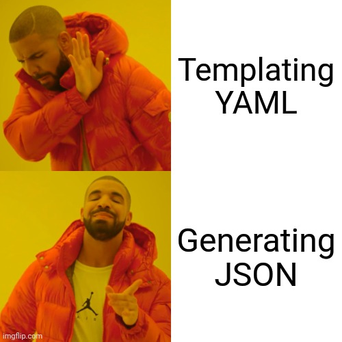

# Dotnet application deployment on AKS using Jsonnet

[](https://builtwithnix.org)

This repo contains a little proof of concept I am working on to easily deploy dotnet applications that would normally be hosted on Azure app service or using Azure function apps on Azure Kubernetes Service (AKS). This is mostly in the interest of being able to run them on non-Azure environments such as in a local cluster using Minikuber or Rancher Desktop.

## Goals:

1. First-class support for AKS-specificities like loading application secrets from Key Vaults
2. Ability to scaffold entire behemoths of kubernetes manifests while only requiring application-specific parameters from users.
3. Ability to set base and per-environment application setting overrides.
4. Support substituting AKS-specificities with local equivalents or mocks to make sure applications can always be run locally in an enironment as identical as possible to the cloud
5. Be as DRY as possible.

## The approach:

I evaluated a few different solutions to the problem at hand including [Helm](https://helm.sh), [Kustomize](https://kustomize.io) and [Jsonnet](https://jsonnet.org).

Kustomize was the first solution I evaluated, mostly because I have a lot of experience with it, having used it extensively in my homelab and in production. It was an immediate non-starter for me because, as I learned from haivng used it a lot, its lack of "templating" leads to either the need to duplicate a lot of patches per-environment, making it the opposite of DRY, or to use an external program like `envsubst` to template over its output.

Helm is another solution I investigated, but I just can't stand its whole premise being templating YAML textually. I mean... [why the fuck are we templating YAML?](https://leebriggs.co.uk/blog/2019/02/07/why-are-we-templating-yaml) Is [this](https://github.com/bitnami/charts/blob/master/bitnami/redis/templates/master/application.yaml) really what we want to be writing and debugging all day when our templating engine, completely unaware of the semantics of the structures we are building, is templating whitespace-sensitive files? I could go on about this, but let's not get causght up.

There is, fortunately, a saner approach than templating to create configuration files... generating them! With a tool aware of the actual structures we are creating! Kubernetes uses YAML as its configuration format, which is a superset of JSON. This means we can use a purpose-built configuration DSL like Jsonnet to scaffold all of our deployment manifests and feed them directly into kubernetes as json or to optionally convert them to YAML before doing that.



Yeah, that's the approach I am taking in this project 😎

## Roadmap:

- [x] Scaffolding configurations for `Deployment`, `Service` and `Ingress` from settings file
- [x] Support for AKS Key Vault CSI driver
- [x] Basic support for `dotnet-monitor` sidecar container
- [ ] Full support for `dotnet-monitor` sidecar container
- [ ] CRD support for `ServiceMonitor` etc.
- [ ] Environment-specific settings overrides
- [ ] Kubectl diff/Apply scripts

## Development instructions

1. Install [Nix](https://nixos.org/download.html) on your system and enable flake support.
2. If you have `direnv` installed and set up, run `direnv allow`. Otherwise, enter the `devShell` using `nix develop`.
3. Hack away!

## Runtime instructions

A sample run of the project's output is provided in the `output.yaml` file.

To generate it yoruself, run:
```console
jb update
jsonnet -J vendor app.jsonnet | gojsontoyaml
```
